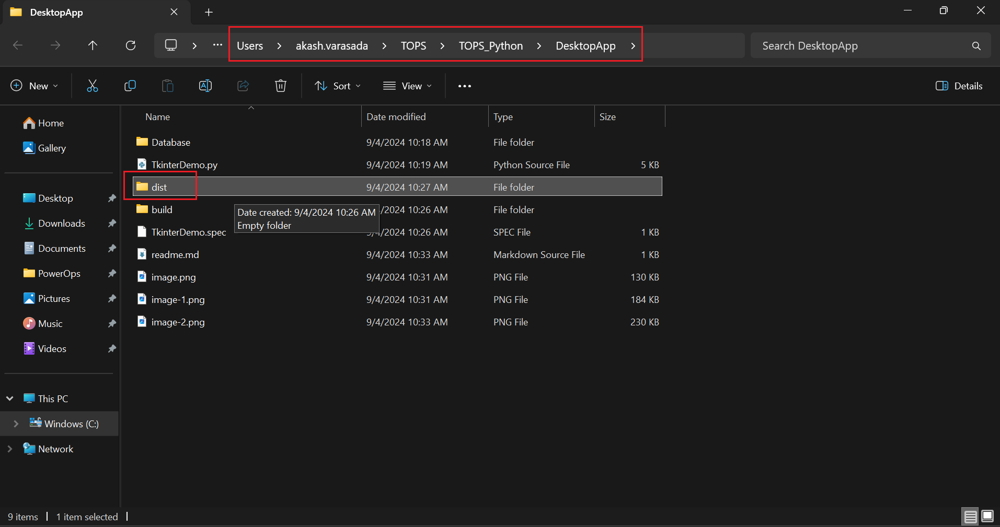

# How to create a .exe file for your code.

### Step-1 Open command prompt and install pyinstaller using following code.
    pip install pyinstaller

### Step-2 Update the path of the folder
use CD command to update the directory.

    cd C:\Users\akash.varasada\TOPS\TOPS_Python\DesktopApp

### Step-3 Create an .exe file.
    pyinstaller --onefile --noconsole TkinterDemo.py

### Step-4 go to the directory.dist folder should contain .exe file.

