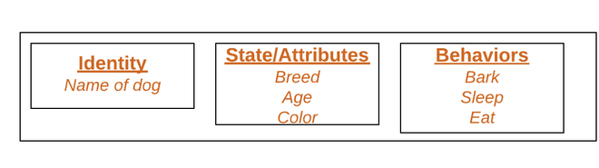

# Object oriented concepts:

1. Class
2. Object
3. Inheritance
4. Polymorphism
5. Abstraction
6. Encapsulation

## Class :
group of different types of variable and functions.

A class is a user-defined data type. It consists of data members and member functions, which can be accessed and used by creating an instance of that class. It represents the set of properties or methods that are common to all objects of one type. A class is like a blueprint for an object.

For Example: Consider the Class of Cars. There may be many cars with different names and brands but all of them will share some common properties like all of them will have 4 wheels, Speed Limit, Mileage range, etc. So here, Car is the class, and wheels, speed limits, mileage are their properties.

## Object :
it is an instance of class.

An object has an identity, state, and behavior. Each object contains data and code to manipulate the data. Objects can interact without having to know details of each other’s data or code, it is sufficient to know the type of message accepted and type of response returned by the objects.

For example “Dog” is a real-life Object, which has some characteristics like color, Breed, Bark, Sleep, and Eats.

## Inheritance:
object of one class can acquire the properties of objects of another class.

creation of new class from an existing class is called Inheritance.

The capability of a class to derive properties and characteristics from another class is called Inheritance. When we write a class, we inherit properties from other classes. So when we create a class, we do not need to write all the properties and functions again and again, as these can be inherited from another class that possesses it. Inheritance allows the user to reuse the code whenever possible and reduce its redundancy.

### Types of Inheritance:

1. Single Inheritance
2. Multiple Inheritance
3. Multilevel inheritance
4. Hierarchical Inheritance
5. Hybrid Inheritance

## Polymorphism:
One name multiple form.

The word polymorphism means having many forms. In simple words, we can define polymorphism as the ability of a message to be displayed in more than one form. For example, A person at the same time can have different characteristics. Like a man at the same time is a father, a husband, an employee. So the same person posses different behavior in different situations. This is called polymorphism.

### Types:

1. Compiled Time Polymorphism - Method overloading

    when there is a more than one method in a single class having the same name with different number of arguments and their data types that is called method overloading.

2. runtime Polymorphism - Method Overriding

    Where there is a same method prototype in your both base class derived class and if you call that method using the object of derived class then only derived class method will be called. You can say that method of derived class overrides method of base class.

## Abstraction:
It is used for the data hiding.

Data abstraction refers to providing only essential information about the data to the outside world, hiding the background details or implementation. Consider a real-life example of a man driving a car. The man only knows that pressing the accelerators will increase the speed of the car or applying brakes will stop the car, but he does not know about how on pressing the accelerator the speed is increasing, he does not know about the inner mechanism of the car or the implementation of the accelerator, brakes, etc in the car. This is what abstraction is.

## Encapsulation:
To bind a code and data in a single unit is called encapsulation.

Encapsulation is defined as the wrapping up of data under a single unit. It is the mechanism that binds together code and the data it manipulates. In Encapsulation, the variables or data of a class are hidden from any other class and can be accessed only through any member function of their class in which they are declared. As in encapsulation, the data in a class is hidden from other classes, so it is also known as data-hiding.

## Super() Method

The super() method in Python is used to call a method from a parent class. It is particularly useful in multiple inheritance scenarios to ensure that the method resolution order (MRO) is followed correctly. Here’s a breakdown of how it works:

**Calling Parent Class Methods**: super() allows you to call methods from a parent class without explicitly naming the parent class. This makes your code more maintainable and flexible.

**Method Resolution Order (MRO)**: In cases of multiple inheritance, super() ensures that the methods are called in the correct order as defined by the MRO. This prevents issues like calling the same method multiple times or skipping a method.

**Syntax**: The basic syntax is super().method_name(). This calls the method_name from the parent class.
