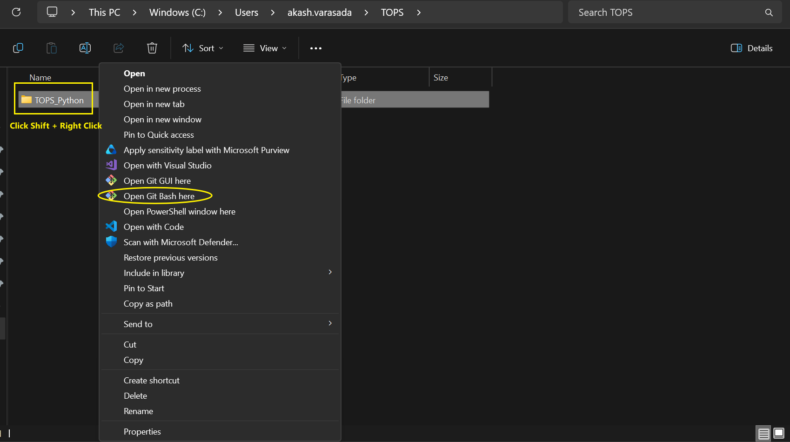
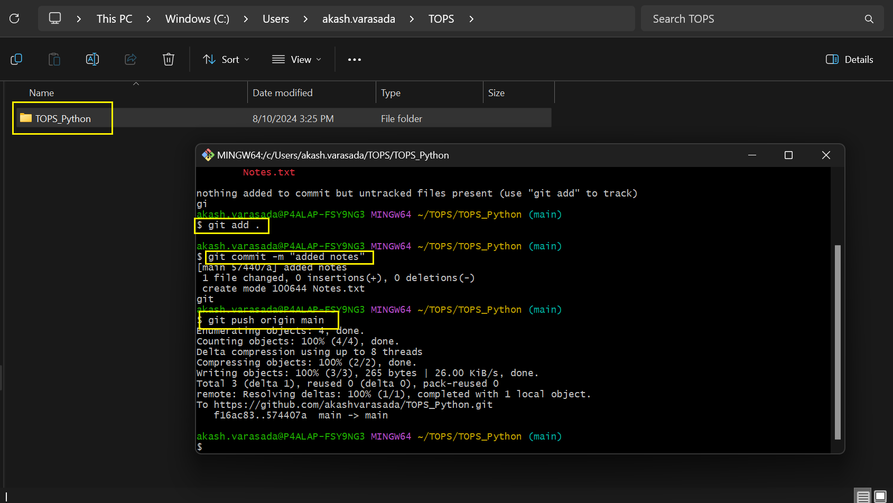
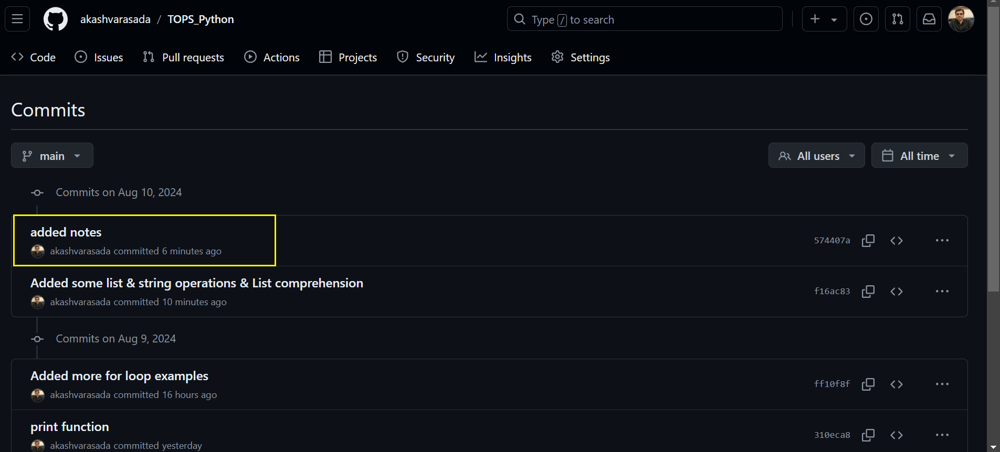

# TOPS_Python
## Good reads:

Python guide by standford : https://cs.stanford.edu/people/nick/py/

Built in functions: https://docs.python.org/3/library/functions.html

Data structures : https://docs.python.org/3/tutorial/datastructures.html

## Documents:

Notes : https://www.notion.so/Software-Devlopment-3a1dc95a69034c97bea069f97fd45710

github: https://github.com/akashvarasada/TOPS_Python

## Setup:

Setup profile in github : https://github.com/akashvarasada/TOPS_Python

Download git bash : https://git-scm.com/download/win

Set credentials for github Onetime.

git config --global [user.name](http://user.name/) "Your Name"

git config --global user.email "[you@example.com](mailto:you@example.com)"

PS C:\Users\akash.varasada\Udemy-Python> git config --global [user.name](http://user.name/) "akash.varasada"

PS C:\Users\akash.varasada\Udemy-Python> git config --global user.email "[akash.varasada@gmail.com](mailto:akash.varasada@gmail.com)"

## Git bash for version control

##### Step-1 go on the repo folder and do Shift + right click and select "Open Git Bash here" option.

##### step-2 follow along with the code given in the snapshot.

##### step-3 validate in github remote.

